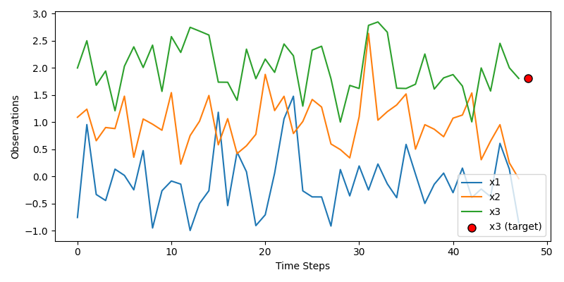
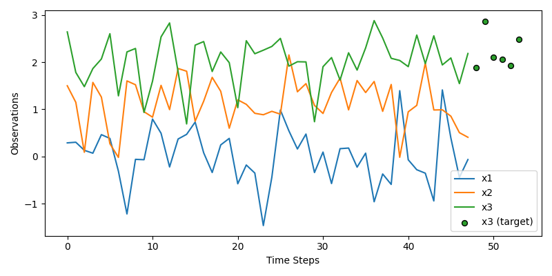
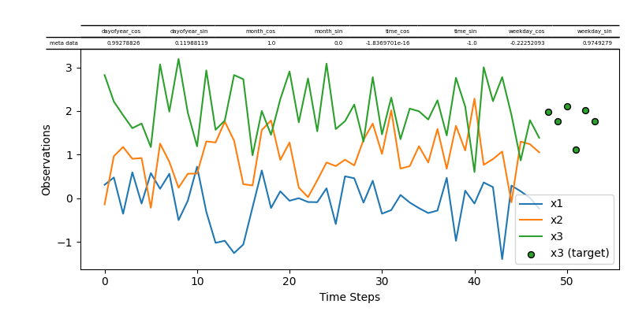

# Table of Contents

1.  [About The Project](#about-the-project)
2.  [Usage](#usage)
    1.  [Example Data](#org7c75667)
    2.  [Single-Step Prediction](#orgd939b15)
    3.  [Multi-Step Prediction](#org55070f1)
    4.  [Add Meta data as features](#org876f56c)
3.  [Contributing](#contributing)
4.  [License](#license)
5.  [Contact](#contact)
6.  [Acknowledgments](#acknowledgments)

# About The Project

This python packages should help you to create TensorFlow datasets for time-series data.

# Usage

## Example Data

Suppose you have a dataset in the following form:

    import numpy as np
    import pandas as pd
    
    columns=['x1', 'x2', 'x3']
    periods=48 * 14
    test_df=pd.DataFrame(
        index=pd.date_range(
            start='1/1/1992',
            periods=periods,
            freq='30T'
        ),
        data=np.stack(
            [
                np.random.normal(0,0.5,periods),
                np.random.normal(1,0.5,periods),
                np.random.normal(2,0.5,periods)
            ],
            axis=1
        ),
        columns=columns
    )
    test_df.head()

                               x1        x2        x3
    1992-01-01 00:00:00  0.075585  1.494057  2.218411
    1992-01-01 00:30:00  0.002626  0.894208  2.039533
    1992-01-01 01:00:00  0.046454  0.529587  2.066533
    1992-01-01 01:30:00  0.320631  1.071333  1.986123
    1992-01-01 02:00:00 -0.540393  1.085246  2.805066

## Single-Step Prediction

this module contains the factory class `WindowedTimeSeriesDatasetFactory` to create a TensorFlow dataset from pandas dataframes, or other data sources as we will see later.
We will use it now to create a dataset with `48` historic time-steps as the input to predict a single time-step in the future.

    from tensorflow_time_series_dataset import WindowedTimeSeriesDatasetFactory as Factory
    
    factory_kwds=dict(
        history_size=48,
        prediction_size=1,
        history_columns=['x1', 'x2', 'x3'],
        prediction_columns=['x3'],
        batch_size=4
    )
    factory=Factory(**factory_kwds)
    ds1=factory(test_df)
    ds1

This returns the following TensorFlow Dataset:

    <PrefetchDataset shapes: ((4, 48, 3), (4, 1, 1)), types: (tf.float32, tf.float32)>

We can plot the result with the utility function `plot_path`:

    from tensorflow_time_series_dataset.utils.visualisation import plot_patch
    fig=plot_patch(
        ds1,
        figsize=(8,4),
        **factory_kwds
    )
    
    fname='.images/example1.png'
    fig.savefig(fname)
    fname

## Multi-Step Prediction

Lets now change the prediction size to a whole day consisting of `6` half-hour time-steps.

    factory_kwds.update(dict(
        prediction_size=6
    ))
    factory=Factory(**factory_kwds)
    ds2=factory(test_df)
    ds2

This returns the following TensorFlow Dataset:

    <PrefetchDataset shapes: ((4, 48, 3), (4, 6, 1)), types: (tf.float32, tf.float32)>

Again, lets plot the results to see what changed:

    fig=plot_patch(
        ds2,
        figsize=(8,4),
        **factory_kwds
    )
    
    fname='.images/example2.png'
    fig.savefig(fname)
    fname

## Add Meta data as features

this module contains the factory class `WindowedTimeSeriesDatasetFactory` to create a TensorFlow dataset from pandas dataframes, or other data sources as we will see later.

    import itertools
    from tensorflow_time_series_dataset.preprocessors import CyclicalFeatureEncoder
    encs = {
        "weekday": dict(cycl_max=6),
        "dayofyear": dict(cycl_max=366, cycl_min=1),
        "month": dict(cycl_max=12, cycl_min=1),
        "time": dict(
            cycl_max=24 * 60 - 1,
            cycl_getter=lambda df, k: df.index.hour * 60 + df.index.minute,
        ),
    }
    factory_kwds.update(dict(
        meta_columns=list(itertools.chain(*[[c+'_sin', c+'_cos'] for c in encs.keys()]))
    ))
    factory=Factory(**factory_kwds)
    for name, kwds in encs.items():
        factory.add_preprocessor(CyclicalFeatureEncoder(name, **kwds))
    ds3=factory(test_df)
    ds3

This returns the following TensorFlow Dataset:

Again, lets plot the results to see what changed:

    fig=plot_patch(
        ds3,
        figsize=(8,4),
        **factory_kwds
    )
    
    fname='.images/example3.png'
    fig.savefig(fname)
    fname

# Contributing

Contributions are what make the open source community such an amazing
place to learn, inspire, and create. Any contributions you make are
**greatly appreciated**.

If you have a suggestion that would make this better, please fork the
repo and create a pull request. You can also simply open an issue with
the tag &ldquo;enhancement&rdquo;. Don&rsquo;t forget to give the project a star! Thanks
again!

1.  Fork the Project
2.  Create your Feature Branch
3.  Commit your Changes
4.  Push to the Branch
5.  Open a Pull Request

Any contributions are **greatly appreciated**.

# License

Distributed under the [Apache License 2.0](LICENSE)

# Contact

[Marcel Arpogaus](https://github.com/marpogaus) - [marcel.arpogaus@gmail.com](mailto:marcel.arpogaus@gmail.com)

Project Link:
<https://github.com/MArpogaus/tensorflow_timeseries_dataset>

# Acknowledgments

Parts of this work have been funded by the Federal Ministry for the Environment, Nature Conservation and Nuclear Safety due to a decision of the German Federal Parliament (AI4Grids: 67KI2012A).

